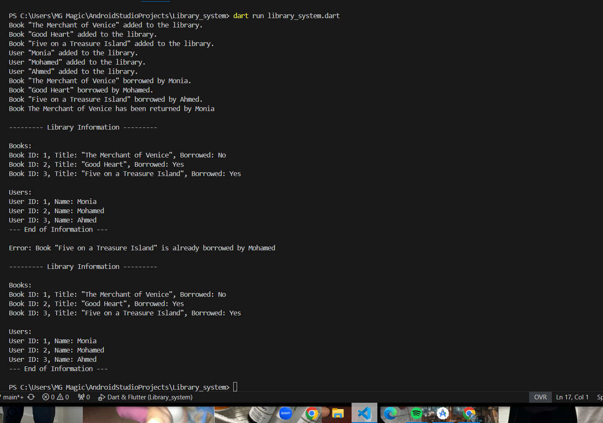

# Library System in Dart

This project demonstrates a simple library system for managing books and users. Users can borrow and return books, and the system keeps track of the info about books

## Features:
- **Book Class**: Represents books with attributes `id`, `title`, and `borrowed`.
- **User Class**: Represents users with attributes `id` and `name`.
- **Library Class**: Handles operations like adding books/users, borrowing, returning, and displaying information.

## Example Usage
1. Add books and users.
2. Perform borrowing and returning operations.
3. Display the final state of the library.

## Output Screenshot

